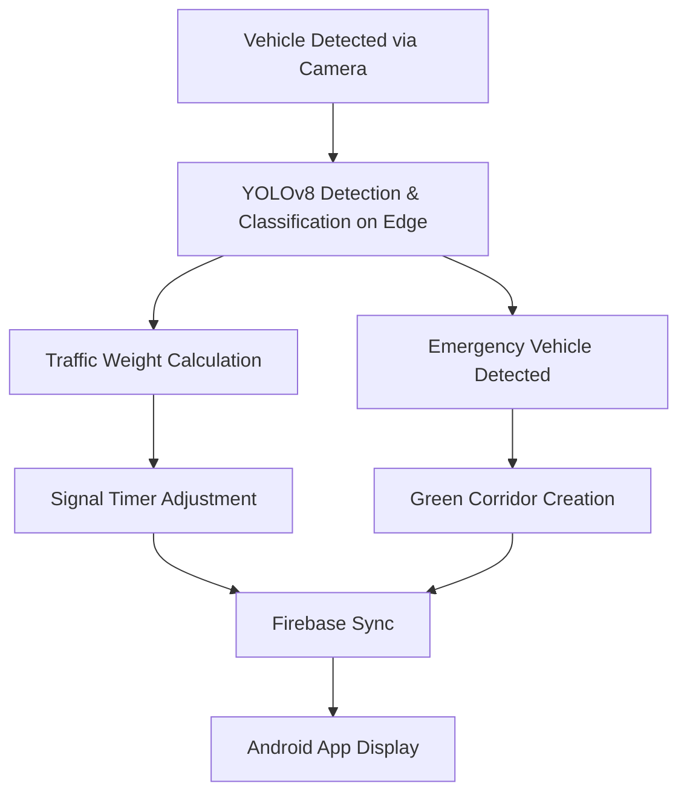

# DirecTo🚦 Smart Traffic Management System Using Edge Computing  
### *Google Solution Challenge 2025 – Open Innovation*

## 🌍 Overview  
A real-time AI-powered system designed to **reduce urban traffic congestion**, **prioritize emergency vehicles**, and **predict traffic patterns** using **Edge Computing** and **Machine Learning**. Built for smart cities, this solution enables scalable, responsive traffic control without relying solely on cloud infrastructure.

---

## 🔧 Features

- 🛑 **Real-Time Signal Control**  
  Uses live camera feeds and YOLO object detection on edge devices (ESP32-CAM & Raspberry Pi) to control traffic lights based on vehicle density.

- 🚑 **Emergency Vehicle Prioritization**  
  Detects emergency vehicles and creates a **Green Corridor** by automatically altering signal states across intersections.

- 🚗 **Vehicle Classification**  
  Classifies two-wheelers, cars, buses, and trucks using YOLOv8 to determine traffic weightage and manage green time efficiently.

- 🔮 **Traffic Forecasting with AI**  
  Uses **Gemini AI** and **LSTM models** to predict future traffic congestion and optimize routing decisions.

- 📱 **Android App for Users**  
  Displays live signal status, voice-based navigation, emergency alert system, and route suggestions using real-time data.

- ☁️ **Cloud Integration via Firebase**  
  Syncs traffic data, alerts, and signal state information in real-time for coordination between edge devices and the app.

---

## 🧠 Tech Stack

| Component          | Tools & Tech                                  |
|--------------------|-----------------------------------------------|
| **Hardware**        | ESP32-CAM, Ultrasonic Sensors, Raspberry Pi 4 |
| **AI/ML**           | YOLOv8 (Object Detection), Gemini + LSTM      |
| **Programming**     | Python (OpenCV, TensorFlow), C++ (Arduino), Java (Android Studio) |
| **Cloud**           | Firebase (Realtime DB)                        |
| **Edge Processing** | Raspberry Pi 4, ESP32 with onboard camera     |
| **Frontend (App)**  | Android Studio                                |

---

## 🎯 Alignment with United Nations Sustainable Development Goals (SDGs)

🌆 **Goal 11: Sustainable Cities**  
Smarter traffic flow and cleaner air quality through optimized signaling  

🏥 **Goal 3: Good Health**  
Quicker ambulance routing, reducing emergency response delays  

🏗️ **Goal 9: Industry & Infrastructure**  
Leverages AI and IoT for next-gen smart road infrastructure  

🌱 **Goal 13: Climate Action**  
Reduced idle time leads to fewer emissions  

♻️ **Goal 12: Responsible Consumption**  
Efficient use of resources and minimal system overhead  

💼 **Goal 8: Decent Work & Economic Growth**  
Enhances urban productivity and creates new tech-based job roles  

---

## 📸 App Screenshots / Videos

>  YouTube links here

---

## 🛠️ How It Works

## **Team Members**  

    
    
    
    
    
    

